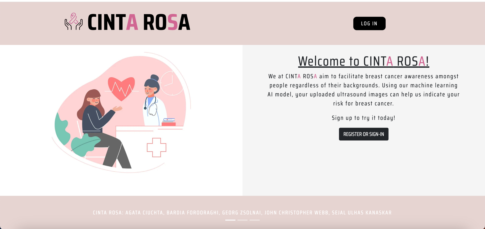
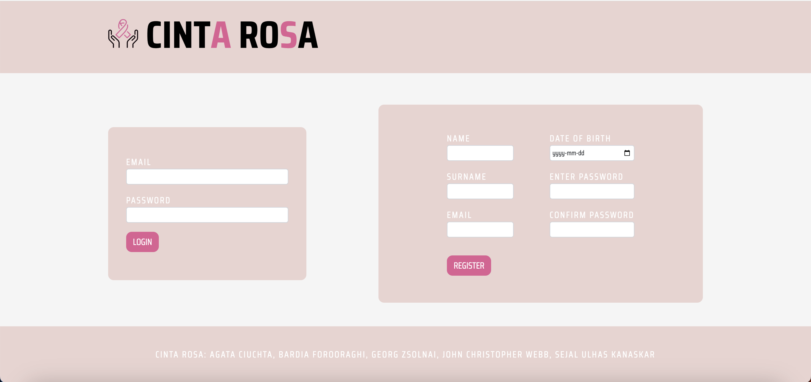
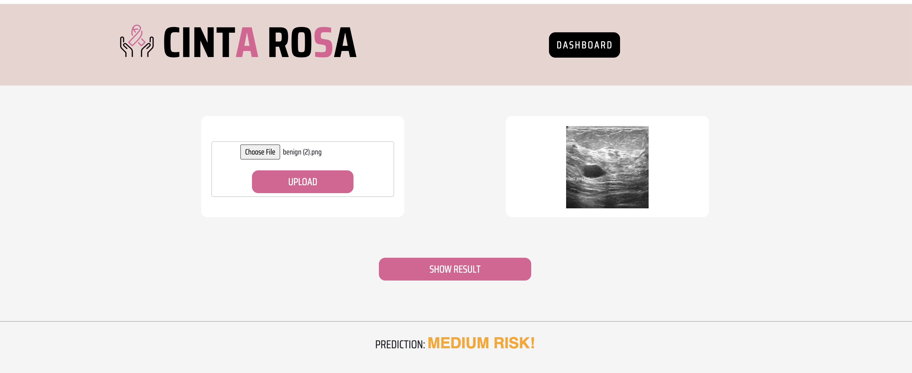
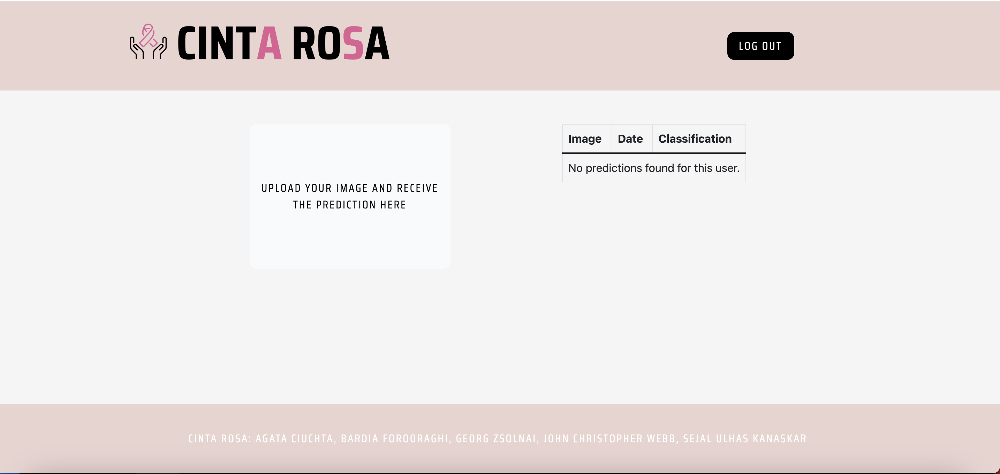
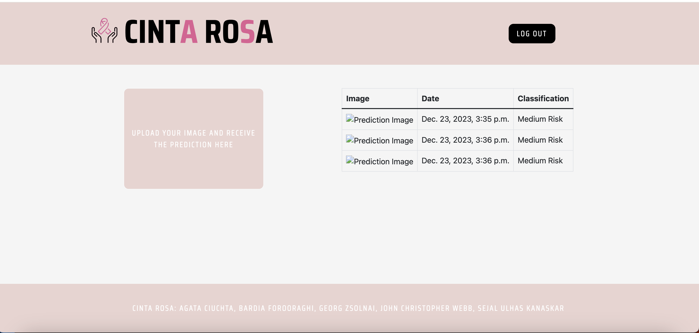
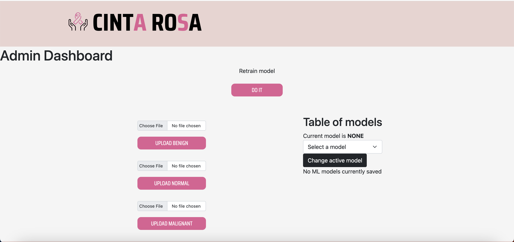
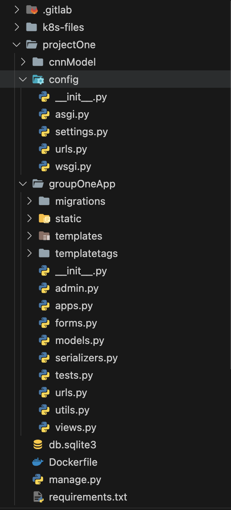
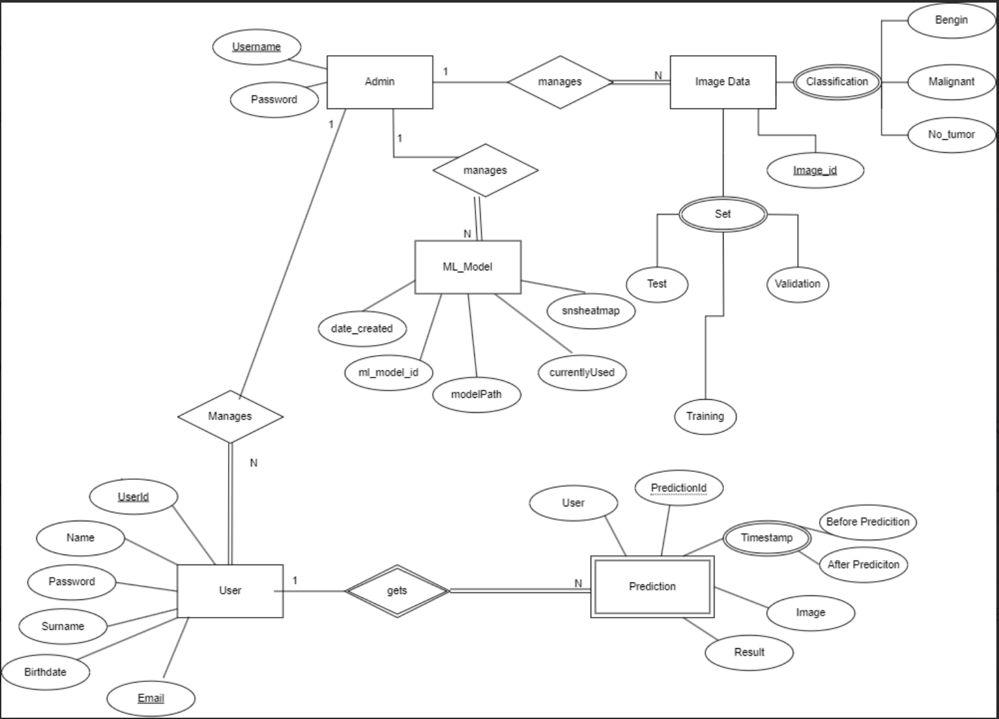

# DIT826-group1-part2
[comment]: <> (author: bardiaf - gusforoba@student.gu.se)

# CINTA ROSA 

Revolutionary breast cancer detection online.

# Table of Contents
- [Introduction](#introduction)
  - [Project Overview](#project-overview)
  - [Purpose and Goals](#purpose-and-goals)

- [Project Initiation](#project-initiation)
  - [For Developers](#for-developers)
    - [Installation](#installation)
    - [System Requirements](#system-requirements)
    - [Dependencies](#dependencies)
  - [For Users](#for-users)
    - [How to use the website (For regular users)](#how-to-use-the-website-for-regular-users)
    - [How to use the website (For administrators)](#how-to-use-the-website-for-administrators)

- [Project Structure (For Developers)](#project-structure-for-developers)
  - [Directory Layout](#directory-layout)
  - [Database Structure](#database-structure)

- [Deployment](#deployment)
  - [Prerequisites](#prerequisites)
  - [Admin Functions on Deployment](#admin-functions-on-deployment)
      - [Find the pod](#find-the-pod)
      - [Create Superuser for admin page](#create-superuser-for-admin-page)
      - [Add image data to deployed pod](#add-image-data-to-deployed-pod)
      - [Connect to pod for command line access](#connect-to-pod-for-command-line-access)
      - [display the name of the currently running pod](#display-the-name-of-the-currently-running-pod)
  - [Google Cloud Setup](#google-cloud-setup)
  - [Google Cloud Deployment Structure](#google-cloud-deployment-structure)
  - [How Deployments Are Updated](#how-deployments-are-updated)

- [Support](#support)

- [License](#license)

<a name="introduction"></a>
# Introduction

<a name="project-overview"></a>
### **Project Overview** 
Our project revolves around the development of a cutting-edge breast cancer detection website. Harnessing the power of Convolutional Neural Networks (CNN), the platform is designed to analyze medical images, specifically those of breast tissue, with the goal of swiftly and accurately identifying potential tumors. This technological innovation has the potential to significantly improve the early detection of breast cancer, offering a valuable tool for individuals alike.

<a name="purpose-and-goals"></a>
### **Purpose and Goals**
The primary purpose of our project is to contribute to the early detection of breast cancer, a crucial factor in improving patient outcomes. By leveraging advanced algorithms, we aim to automate the analysis of breast tumor characteristics, classifying them as malignant, benign, or normal. Our goals include providing a user-friendly platform that simplifies the detection process, ensuring accessibility for the general public. Through this project, we aspire to make a meaningful impact on the efficiency and accuracy of breast cancer diagnosis, ultimately leading to better prognosis and timely medical interventions.

<a name="project-initiation"></a>
# Project Initiation 

<a name="for-developers"></a>
### **For Developers**

<a name="installation"></a>
### **Installation**
1. Go to https://git.chalmers.se/courses/dit826/2023/group1/dit826-group1
2. Clone the project into a directory of your choosing using either SSH or HTTPS
3. To run the project, open the project on terminal and run the following steps:
```bash
cd projectOne
```
```bash
python manage.py runserver
```
<a name="system-requirements"></a>
### **System Requirements**

##### Minimum Requirements

- **Operating System:** Windows 10, macOS 10.14, Ubuntu 18.04 LTS, or a compatible OS
- **Processor:** Dual-core processor, 2.0 GHz
- **RAM:** 4 GB
- **Storage:** 20 GB available space
- **Internet Connection:** Required for initial setup and updates

##### Recommended Specifications

- **Operating System:** Windows 10, macOS 10.15, Ubuntu 20.04 LTS, or a compatible OS
- **Processor:** Quad-core processor, 3.0 GHz
- **RAM:** 8 GB or higher
- **Storage:** 50 GB available space (SSD recommended for faster performance)
- **Graphics:** Dedicated graphics card with 2 GB VRAM
- **Internet Connection:** Required for regular updates and access to online features

##### Software Dependencies

- Python 3.8 or higher
- Docker (optional, for containerized deployment)

<a name="dependencies"></a>
### **Dependencies**
- **Django and Web Framework:**

    - Django==4.2.7
    - django-environ>=0.7,<1.0
    - django-bootstrap-v5==1.0.11
    - django-bootstrap5
    - djangorestframework-simplejwt
    - djangorestframework
    - django-cors-headers

- **Model Dependencies:**

    - cppimport
    - pybind11
    - seaborn
    - scikit-learn
    - numpy
    - pandas
    - matplotlib
    - eli5
    - pydot
    - tensorflow
    - opencv-python

To ensure smooth execution of the project, follow these steps:

1. **Install Python and pip:**
   Make sure you have Python and pip installed on your system.

2. **Create a Virtual Environment:**
   It's recommended to use a virtual environment to isolate your project dependencies. Run the following commands:

   ```bash
   python -m venv venv
   source venv/bin/activate   
   #On Windows, use `venv\Scripts\activate`

3. **Install Dependencies:**
Install the required Python packages using pip:
   ```bash
   pip install -r requirements.txt
   ```

4. **Database Migrations (Django Only):**
If you're using Django, perform the database migrations:
   ```bash
   python manage.py migrate
   ```

5. Now you're all set! Your environment should be ready to run the project smoothly.

<a name="for-users"></a>
### **For Users**

<a name="how-to-use-the-website-for-regular-users"></a>
#### How to use the website (For regular users)

1. Head over to our [website](http://34.38.29.191/)
2. On the main page click on LOGIN button if you already have an account, otherwise REGISTER yourself


3. On the prediction page, click on the `choose file` to upload your ultrasonic picture of your breast (.png) and the click on `show result` to see the result

4. On the user dashboard page, you can view the upload history of your images, including associated date and corresponding results


Clicking on the pink box on the left side of the page will navigate you to the prediction page, allowing you to upload additional images

<a name="how-to-use-the-website-for-administrators"></a>
#### How to use the website (For administrators)
On the admin dashboard page, administrators have three options that contribute to model retraining, ultimately enhancing model accuracy


1. **Upload image(s):** On the left side, you have the option to upload images. Images can be uploaded either in batches or as individual files. If you choose to upload a batch of images, they should be in the form of zip files. For single-image uploads, ensure the image is in the PNG file format

    **NOTE**: The zip file you wish to upload must contain PNG files exclusively. If there are any other image formats inside, the website will only unzip the PNG files and proceed with the upload.

2. **Retrain:** After uploading images, in the middle section of the page, the admin can choose to click on 'Retrain' the model.

3. **Table of models:** You can explore various models and select one based on your preference, also viewing each model's accuracy.

<a name="project-structure-for-developers"></a>
# Project Structure (For Developers)
### Directory Layout
The project primarily comprises two components: cnnModel, responsible for designing the model and handling training and prediction, and groupOneApp, where the database structure, frontend, and backend of the website are defined.


<a name="database-structure"></a>
### Database Structure
In the image provided, you will discover our database design, illustrating the relationships between entities. This offers a comprehensive overview of the project.


<a name="deployment"></a>
# Deployment

### Prerequisites
- [here](https://cloud.google.com/sdk/docs/install#installation_instructions) you can install the gcloud cli tool required to access gcloud from the terminal
- [here](https://cloud.google.com/kubernetes-engine/docs/how-to/cluster-access-for-kubectl#install_kubectl) you can install kubectl, and it provides guidance on all the necessary installations required for using kubectl with the cluster

- Sign into gcloud with `gcloud init`
  - Please make sure the administrator has added you to the cluster so that you can select the correct project for cluster access


<a name="admin-functions-on-deployment"></a>
### Admin Functions on Deployment

<a name="find-the-pod"></a>
1. #### **Find the pod**
- Navigate to the Google Cloud dashboard and locate the deployed pod
- Use `kubectl get pods` and take the name displayed in the cmd line

<a name="create-superuser-for-admin-page"></a>
2. #### **Create Superuser for admin page**

   ```bash
   kubectl exec -it POD-NAME -- /bin/bash -c "cd /projectOne && python manage.py createsuperuser" 
   ```

<a name="add-image-data-to-deployed-pod"></a>
3. #### **Add image data to deployed pod**

   When inside the base directory (dit-group1-part2/)
   ```bash
   cd projectOne/cnnModel && kubectl cp kaggle_image_data POD-NAME:/projectOne/cnnModel/kaggle_image_data
   ```

<a name="connect-to-pod-for-command-line-access"></a>
4. #### **Connect to pod for command line access**

   Connecting to the pod lets you check files, upload files and transfer files to local machines
   ```bash
   kubectl exec -it POD-NAME -- bash -c "cd /projectOne && /bin/bash"
   ```

<a name="display-the-name-of-the-currently-running-pod"></a>
5. #### **Run this command to display the name of the currently running pod**
   ```bash
   kubectl get pods | grep -e "Running" | awk '{print $1}'
   ```


<a name="google-cloud-setup"></a>
### **Google cloud setup**
In the prerequisites, it demonstrates the process of logging into gcloud and installing kubectl.

<a name="google-cloud-deployment-structure"></a>
### **Google cloud deployment structure**
tbd

<a name="how-deployments-are-updated"></a>
### **How deployments are updated**
After checking `kubectl get pods` you can find the name of the current pod and using `kubectl delete POD-NAME` it will delete the pod and kuberenetes will re-pull the image and re-deploy the new image.
Another way to re-deploy is to create a tag with the schema: v1 where the numbering depends on the developer. This will invoke the deploy stage in the gilab-ci and do the steps mentioned above automatically as well as re-building the image to the container registry.

<a name="support"></a>
# Support
If you have any technical or general questions, suggestions, or concerns about the project, feel free to contact the project developers via email.
- AGATA CIUCHTA - gusciuag@student.gu.se
- BARDIA FOROORAGHI - gusforoba@student.gu.se 
- GEORG ZSOLNAI - guszsoge@student.gu.se 
- JOHN CHRISTOPHER WEBB - guswebbjo@student.gu.se
- SEJAL ULHAS KANASKAR - guskanase@student.gu.se

<a name="license"></a>
# License
This project is licensed under the MIT License
[](https://opensource.org/licenses/MIT)